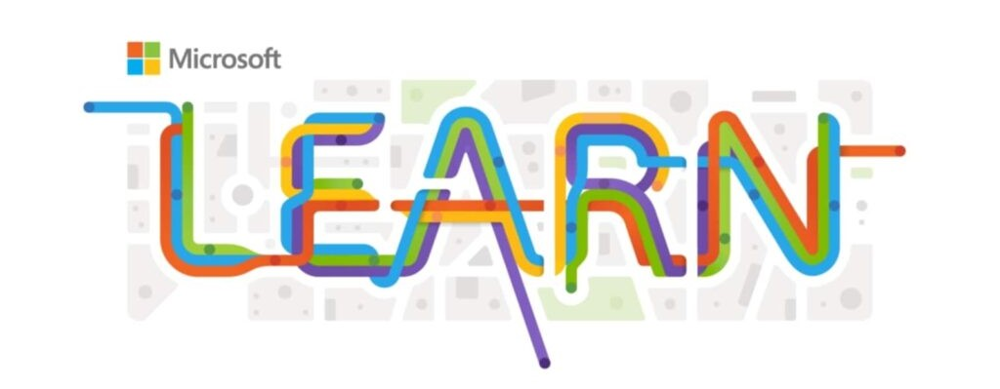

# Microsoft Students Club Certification Pathways

Welcome to the Microsoft Students Club Certification Pathways! Below are the links to the respective courses:

1. Fundamentals of Generative AI:
   - [Course Link](https://learn.microsoft.com/en-us/training/modules/fundamentals-generative-ai/)

2. Fundamentals of Machine Learning:
   - [Course Link](https://learn.microsoft.com/en-us/training/modules/fundamentals-machine-learning/)

3. Get Started with AI Fundamentals:
   - [Course Link](https://learn.microsoft.com/en-us/training/modules/get-started-ai-fundamentals/)

Feel free to explore these courses and start your journey towards certification. Happy learning!
